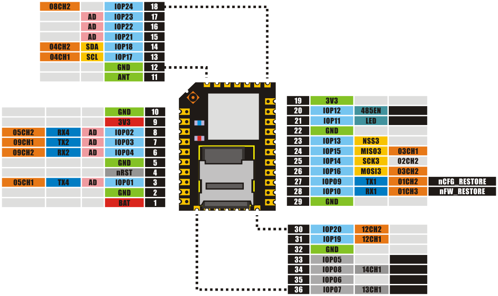

#helloRGB: 如何实现下行云控制（RGB-LED灯）

##概述

这个例子是演示通过PWM控制3色RGB LED灯。同时演示了如何解析稍微复杂点的json请求。

##使用说明

代码头部宏定义中定义了使用到的PWM通道，可以通过应用板上的IO引脚指示连接 RGB LED模块。

###编译、部署和运行

在云端登录自己的账户，确定设备在线后，可以使用编译器来编译上面的代码，部署时确定名称为“RGB”（下面要用到），然后 运行之。

###本地控制

在“我的设备”界面找到模块本地的IP地址，访问模块主页。在“应用程序”->“委托接口测试” 填入：

	{
		"method":"RGB.pwm",	//这里指定的addon名称为 RGB
		"params":{"r":16, "g":12, "b":99}
	}

点击发送，便可以看到LED变化。这个演示了通过模块的http服务实现JSON RPC的调用。

###远程控制

登录wifi.io网站，“文档资源” -> “调试openAPI”  ，按照说明文字，首先获取Token，之后选择 “向设备发送指令”的API接口。
填入类如：

	{
		"token":"xxxx", //获取的token
		"did":xx, //你的设备编码
		"method":"RGB.pwm",
		"params":{"r":16, "g":12, "b":99}
	}

**注意，注释部分需要删除**

提交后便可以看到LED变化。

****
该示例类似于 helloworld的演示，用户可以对比试验。

更多细节请参考源代码。

20131006
问题和建议请email: dy@wifi.io 

