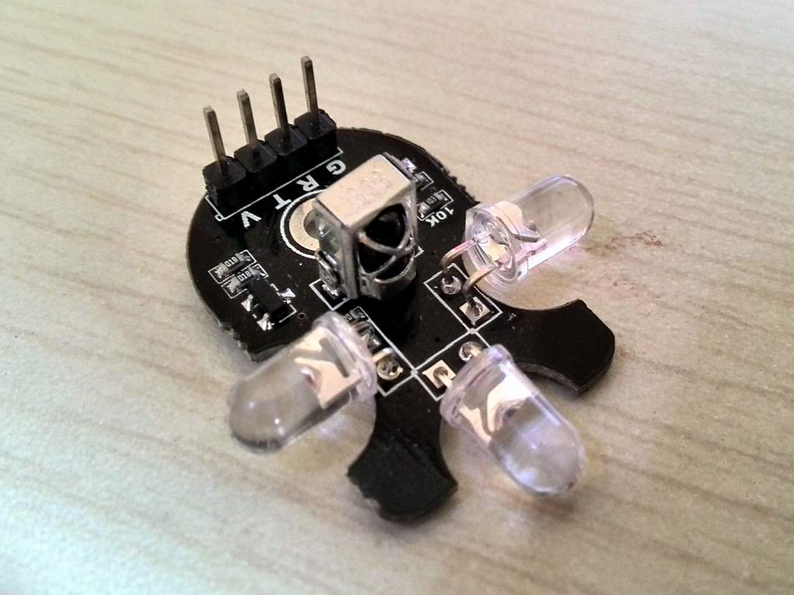

#红外发射与接收

**文档大纲**

- [概述](#overview)
- [如何操作硬件](#HardwareHowTo)
- [如何使用本程序](#SoftwareHowTo)
- [如何操作云端](#CloudHowTo)
- [备注](#notes)
- [依赖](#dependency)

##概述

这个是尝试驱动红外发射管的源代码。

该演示采用硬件定时器计时的方式测量脉宽，重放过程使用硬PWM输出38K载波，通断方式重放红外脉宽。

##如何操作硬件

测试使用的硬件模块如下图：

红外学习使用的是 模块的 IO01 引脚，可以将红外模块标记R的引脚连接到 wifiIO的IO1。

模块底部IO01连接的LED灯，在接收到遥控器发出的信号时，LED会闪烁；
模块主动发送红外信号时，由于红外光线的反馈，该LED也会闪烁。借用这个特征可以观察红外接收、发送状况。

发送使用的是IO03引脚，可以连接红外模块标记T的引脚。（引脚连接依赖于代码中定义，用户最好能自行check代码中使用引脚的宏定义）

##如何使用本程序

这个示例，编译便可以运行。
建议用户使用3.3V的USB转 TTL串口模块，连接wifiIO的UART1（IO09 IO10， @115200buadrate），如此可以得到直观的编码脉宽测量数据。

程序运行机制很简单，等候学习外部的遥控器红外信号，一旦采集到等候5s后，再发射出来，类似一个遥控延时回放功能。

##如何操作云端
无需

##备注
无

##依赖
无

****
更多细节请参考源代码。

20131221
问题和建议请email: dy@wifi.io 

