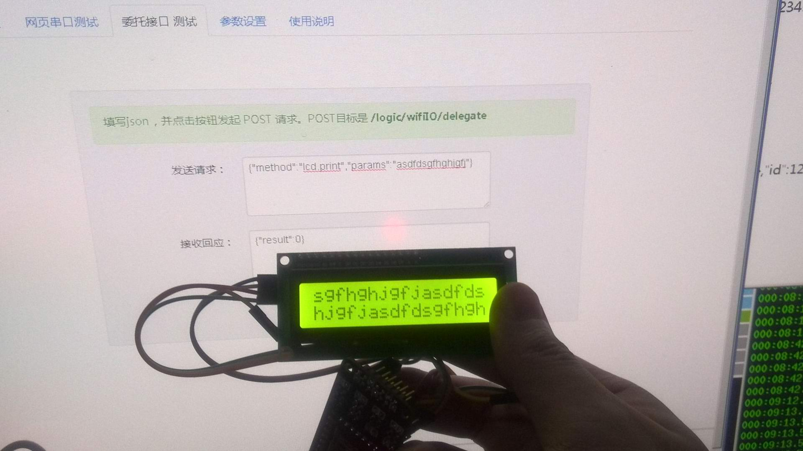

#LCDI2C: 如何驱动IIC接口的LCD显示屏

##概述

这个例子是演示通过IIC接口驱动LCD屏幕。

##使用说明

main函数中定义了两个引脚分别作为SDA和SCL，根据代码定义连接好SDA、SCL ，以及5V和GND。

	api_lcd_i2c.init(WIFIIO_GPIO_01 ,WIFIIO_GPIO_02, PCF8574_Address,16, 2);

###编译、部署和运行

在云端登录自己的账户，确定设备在线后，可以使用编译器来编译上面的代码，部署时确定名称为“lcd”（下面要用到），然后 运行之。

###本地控制

在“我的设备”界面找到模块本地的IP地址，访问模块主页。在“应用程序”->“委托接口测试” 填入：

	{
		"method":"lcd.print",
		"params":"0123456789ABCDEF"
	}

点击发送，便可以看到LCD变化。这个演示了通过模块的http服务实现JSON RPC的调用。

###远程控制

登录wifi.io网站，“文档资源” -> “调试openAPI”  ，按照说明文字，首先获取Token，之后选择 “向设备发送指令”的API接口。
填入类如：

	{
		"token":"xxxx", //获取的token
		"did":xx, //你的设备编码
		"method":"lcd.print",
		"params":"0123456789ABCDEF"
	}

**注意，注释部分需要删除**

提交后便可以看到LCD变化。

****

更多细节请参考源代码。

20131006
问题和建议请email: dy@wifi.io 

