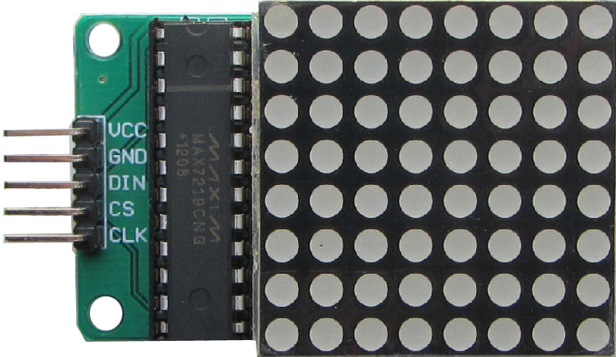
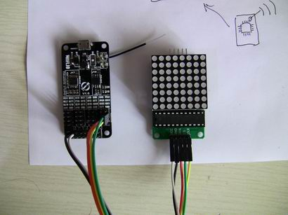
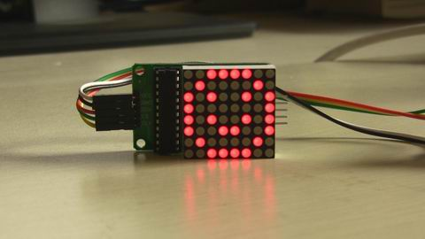

#驱动8x8点阵模块: 基于Max7219芯片

##概述

Max7219芯片是一种段式LED显示模块的驱动芯片，可以使用作为8x8点阵的驱动器。
其有一个类似于SPI的驱动接口，可以直接和wifiIO模块直接相连。

这个淘宝有售：

http://item.taobao.com/item.htm?id=22058276355

或者 搜索 “max7219 模块”

##接线说明

MAX7219 需要三个引脚驱动，其分别为:
CLK，DIN和 CS

* CS: 片选端。该端为低电平时串行数据被载入移位寄存器。连续数据的后16位在cs 端的上升沿时被锁定。
* CLK: 时钟序列输入端。最大速率为10MHz.在时钟的上升沿，数据移入内部移位寄存器。只有当cs 端为低电平时时钟输入才有效。 
* DIN: 串行数据输入端口。在时钟上升沿时数据被载入内部的16位寄存器。

包括 电源和地，一共需要连接5个引脚。

##网页界面
通过addon代码中设计好的JSON接口，可以设计相应的web界面来去驱动Max7219，示例中提供了两个文件：index.html和max7219.js。

您可以在模块的文件系统中建立/app/max7219/的文件夹，将这两个文件（还有max7219.add）上传到该目录。

通过浏览器 模块的网页界面，打开 
http://192.168.1.xxx/app/max7219/index.htm
便可以通过页面操作点阵模块了。

祝玩的开心！

****

更多细节请参考源代码。

20131006
问题和建议请email: dy@wifi.io 

