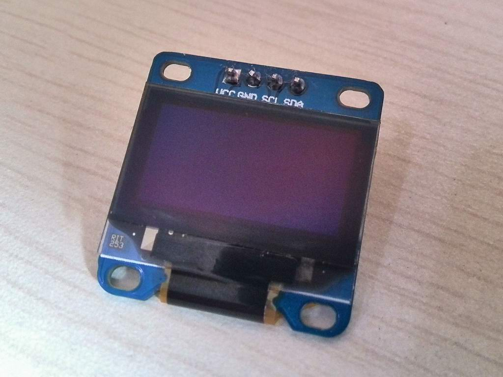

#驱动OLED显示屏

**文档大纲**

- [概述](#overview)
- [如何操作硬件](#HardwareHowTo)
- [如何使用本程序](#SoftwareHowTo)
- [如何操作云端](#CloudHowTo)
- [备注](#notes)
- [依赖](#dependency)

##概述

该代码演示如何使用IIC驱动OLED显示屏。

显示驱动芯片是SSD1306（支持并行总线、SPI、IIC接口），这里为减少引脚使用计，使用IIC接口。器件说明手册：

http://www.adafruit.com/datasheets/SSD1306.pdf

本程序参考了 adafruit 的驱动代码，感谢其作出的工作，链接如下：

http://learn.adafruit.com/monochrome-oled-breakouts/overview

##如何操作硬件

硬件上使用IO17、IO18 连接OLED模块的 SCL、SDA，OLED需要供应3.3V电源。

##如何使用本程序

代码编译部署运行后，会在屏幕上显示 adafruit的logo，之后会显示画圆动画。

##如何操作云端
无需

##备注
无

##依赖
无

****
更多细节请参考源代码。

20131221
问题和建议请email: yizuoshe@gmail.com 

