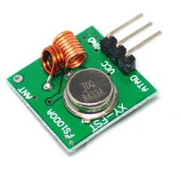

#PulseWidthModulateCode: 脉宽调制编码，实现超廉价的无线遥控

**文档大纲**

- [概述](#overview)
- [脉宽编码描述语言PWCL](#pwcl)
	- [快速进入](#pwcl_quick)
	- [脉宽序列](#pwcl_width_seq)
	- [脉宽时延](#pwcl_width_until)
	- [引用单元](#pwcl_segref)
	- [循环运算](#pwcl_op_iterate)
	- [描述单元](#pwcl_segment)
	- [PWCL程序](#pwcl_program)
	- [示例：串口数据帧](#pwcl_demo_serial)
	- [PWCL程序限制](#pwcl_limitation)
	- [实作：2262编码与315M遥控](#pwcl_2262_RC)
	- [语法](#pwc_grammer)
- [如何使用本程序](#how2use)
- [备注](#notes)
- [依赖](#dependency)

##概述

脉宽调制编码PWC（PulseWidthCodec） 是简单遥控应用中 使用最为广泛的编码方式。它可以将并行的IO信号串行化，进而实现控制信号的无线传递，利用常见的调幅发射接收机（315M、433M）或者红外收发装置，可以实现多种廉价方便的遥控应用。

PT2262、PT2272就是使用这种方式 编解码传递信号的芯片。读者可以google"2262 编码"了解更加细节的编码描述信息。

PWC提供一个脉宽调制生成器，可以连接市面常见的315M 433M无线发射机，以实现对相应接收机的遥控。

脉宽编码的标准很多，除了PT2262系列的射频无线遥控外，红外遥控也包含许多种码字标准，为了使用的灵活性，我们实现了描述编码的特定语言PWCL。使用PWCL用户可以设计任意脉宽波形，利用PWCL（PulseWidthCodeLanguage）语言描述编码波形，可以将任意编码类型抽象为程序语言，从而方便交换和变化码值。

本程序实现了PWCL语言的解释器，你可以直接向其提交 某种编码的 描述程序代码，本程序可以通过IO口播放出相应的编码波形。您可以连接315M、433M 发射机，或者红外发射头，来实现遥控应用。

 

##脉宽编码描述语言PWCL

###快速进入：

`(+200,-200);100*[0];` 表示200us高电平 200us低电平的100次 循环脉宽序列。

示例中被分号分隔的叫做"[描述单元](#pwcl_segment)"，`(+200,-200)`为[脉宽序列](#pwcl_width_seq)，`[0]`为[引用单元](#pwcl_segref)。
最后一个描述单元`100*[0]` 为执行起点。示例中，`100*[0]` 表示第0个描述单元被循环执行 100次。
第0个描述单元即是 `(+200,-200)`。

一个PWCL语言构造的程序，结构为：

	描述单元;描述单元;描述单元;描述单元;

[描述单元](#pwcl_segment) 的细节下详。

###脉宽序列：

脉宽序列 由圆括号包围若干个脉宽长度数值来形成，类如 `(+100,-1000)`

描述语法：

	width:: [+|-]integer
	width_seq:: /(width(,width)* /)

 1. `(+400)`：描述一个 400us的高电平 
 2. `(+400,-400, +400)`：描述一个 高、低、高电平序列，每个都是400us
 3. `(+400,-200, 200)`：描述一个 400us的高电平 和400us的低电平
 

小结：

 - 指示电平使用`+-`符号作为前缀。类似`+100`、`-200`，单位为us；
 - `200` （无符号）表示延续之前电平；
 - `(+1000,-200, …)` 表示一个脉宽序列；
- 字符间不要有空格；

  

###脉宽时延：
脉宽时延 由尖括号包围 时延长度 数值来形成，类如 `<1000>`

描述语法：

 	width_until:: /<width/>

程序运行时，有全局计时器记录运行时间，脉宽时延用于设置 或者利用全局时间来延长波形。

`<0>` 表示清零全局时间。
`<+1000>` 表示以高电平延续直到全局时间达到1000us。

假设程序  `(-700)<+1000>;`，执行到`<+1000>`时，已经输出了700us的低电平，这时全局时间为700us，那么`<+1000>`将输出一个300us的高电平，执行完毕后，全局时间清零。

脉宽时延只能有一个整数，`<+100,+100>` 是错误的。

脉宽时延可以是无符号，例如`<1000>`，无符号表示延续之前电平。

该元素常用于与前方执行的元素相连使用，以实现定长帧。

小结：

 - 脉宽时延 使用全局时间延续波形，执行后全局时间清零；
 - 字符间不要有空格；

###引用单元

引用单元使用方括号包围整数实现对其他[描述单元](#pwcl_segment)的引用，形式为`[x]`。

语法描述为：

	seg_ref:: /[integer/]

例如程序 `	描述单元0;(+100,-200);描述单元2;3*[1];`，最后一个描述单元中，`3*[1]`表示 循环执行描述单元1`(+100,-200)` 三次。

引用单元的存在使得程序可以复用已经定义的波形片段。

引用可用于 [循环](#pwcl_op_iterate)运算，例如，`3*[2](+400,-200)`。

小结：

 - 引用单元不能引用自己 或者不存在的单元；
 - 引用单元不能相互引用，形成引用循环，结果会使程序崩溃。
 - 字符间不要有空格

####循环

[脉宽序列](#pwcl_width_seq)、[脉宽时延](#pwcl_width_until)和[引用单元](#pwcl_segref)都可以使用`10*xxx`形式实施循环运算。

语法描述为：

	op_exp:: integer'*'width_seq	| integer'*'seg_ref | integer'*'width_until

`2*(+200,-200)` 等价于 `(+200,-200)(+200,-200)`。

[脉宽时延](#pwcl_width_until)也可以循环，`2*<+1000>` 等价于`<+1000><+1000>`等价于`<+2000>`。

**小结：**

 - 脉宽序列、脉宽时延 和 引用单元 可以循环执行；
 - `*`不能在循环元素之后，`(+200,-200)*2` 是错误的。
 - 字符间不要有空格

###描述单元

[脉宽序列](#pwcl_width_seq)、[脉宽时延](#pwcl_width_until)和[引用单元](#pwcl_segref) 及其 [循环运算](#pwcl_op_iterate)的相连组合 称为 描述单元。

语法描述为：

	pwc_segment:: (width_seq|width_until|seg_ref|op_exp)+	

两个波形单元相连 表示连续执行。

 - `(+400,-200)(+200)`等同于` (+400,-200,+200)`；
 - `<+100><+100><+100>`等同于 `<+300>`；
 - `<0>(+400,-200,+200)<-1000>` 除了输出高400us低200us高200us电平外，还输出200us低电平，实现1000us总长；

**脉宽时延 相连说明：**

`<0>(+400,-200)<-400>` 中，由于全局时间已经超过400us，故`<-400>`将不会起到明显作用，其仅仅将全局时间减去400us。

可以将两个`<xx>`相连使用，`<0>(+400,-200)<-500><-500>` 完全等同于`<0>(+400,-200)<-1000>`。

###PWCL程序：

一个完整的PWCL程序是由分号隔离的序列[描述单元](#pwcl_segment)，类似于：

	描述单元0;描述单元1;描述单元2;

程序从最后一个描述单元开始运行。

###示例：串口数据帧
9600波特率（1bit脉宽约为 104us），8bit无校验，2位停止位。

    Start BIT0 BIT1 BIT2 BIT3 BIT4 BIT5 BIT6 BIT7 STOP STOP

输出一个0xAA（10101010） 可以描述为：` (-104);(+104);(-104);(+208);[2][0][1][0][1][0][1][0][1][3];`

实际执行序列为最后一个描述单元 `[2][0][1][0][1][0][1][0][1][3]`，其中引用到前面的bit位、起始、终止位描述。其中[2]表示起始位，[3]表示停止位，数据正好可以使用 [0]\[1] 来表达——一般bit0的描述放在起始，bit1放在其次，后文中引用便可以实现 [0]、[1]分别表示bit0\1。

###PWCL程序限制

 - 整个程序不能超过255字节；
 - 脉宽序列中 最短波形为10us——PWCL为解释执行，无法保证10us内波形的输出。类似(+5,-3)，可能无法精确产生高5us低3us的波形。
 - 脉宽序列中 最长波形为65535us，更长可以使用 [循环](#pwcl_op_iterate)运算；类似(+200000,-65536)，是不正确的。
 - 循环运算中 循环次数不能超过255；

###实作：2262编码与315M遥控
常用的2262振荡主频由其振荡电阻决定，计算公式为：

F(KHz) = 32/R(Mohm)

SC2262：1.2M振荡电阻，时钟周期 T 约为 37.5us。

0、1、Z由4T和12T两种宽度的电平组合。

4T = 150us 

12T = 450us	

同步位由4T 高 124T低组成；
124T =4650us

PT2262发出的编码信号由：地址码、数据码、同步码组成一个完整的码字，每次发射时至少发射4组字码。程序设计如下：

	[0]:	2*[4]		//bit0
	
	[1]:	2*[5]		//bit1
	
	[2]:	[4][5]	//Z
	
	[3]:	(+150,-4650)	//Sync
	
	[4]:	(+150,-450)		//+4T  -12T
	
	[5]:	(+450,-150)		//+12T  -4T
	
	[6]:	[2][2][2][1][2][2][1][2]	//测试接收机地址码A0~A7: zzz1zz1z
	
	[7]:	[2][1][2][2]	//测试接收机数据码D3~D0: z1zz

得出代码：
`2*[4];2*[5];[4][5];(+150,-4650);(+150,-450);(+450,-150);[2][2][2][1][2][2][1][2];[6][2][1][2][2][3];4*[7];`

注意：最后一段` 4*[7];` 表示连发4次，以保证接收机确定接收内容。

上述内容演示如何用PWCL语言设计2262编码器波形输出，用户可以将IO引脚输出连接合适频率发射机的 Dat引脚，程序无误的话，可以实现对相应接收机的遥控动作。
后注：
大部分基于2262编码遥控产品都是用2262/1.2M & 2272/200K组合的，少量产品用2262/4.7M & 2272/820K。
若采用4.3M，则：

`2*[4];2*[5];[4][5];(+537,-16662);(+537,-1612);(+1612,-537);[2][2][2][2][2][2][2][2];[6][2][1][2][2][3];4*[7];`

可见脉宽参数变化，只要更改前面被引用的描述单元，后面的编码值部分是可以不变的。

而更改地址或数据值时，仅仅改变后面部分就可以了。

由于振荡电和器件一致性问题，上文中计算公式得到的振荡周期不一定很精确，根据实际测试，1.2M振荡电阻SC2262输出参数如下：

 - 4T  实测约122us
 - 12T 实测约366us
 - 124T 实测约3782us

构造的代码如下：

`2*[4];2*[5];[4][5];(+122,-3782);(+122,-366);(+366,-122);[2][2][2][1][2][2][1][2];...`

由于振荡电阻不同导致程序参数不同，用户可以根据原理调整PWCL程序的细节内容。

###语法

	width:: [+|-]integer

	width_seq:: /(width(,width)* /)

	width_until:: /<width/>

	seg_ref:: /[integer/]

	op_exp:: integer'*'width_seq	|  integer'*'seg_ref	| integer'*'width_until

	pwc_segment:: (width_seq|width_until|seg_ref|op_exp)+	

	pwc:: (pwc_segment;)+

	characters: '('  ')' '['  ']' '<' '>' '*'  ','  '+'  '-'  Integer

##如何使用本程序

以"pwcl"名称加载本程序，通过类似：

	{
		"method":"pwcl.code",
		"params":"(-10000);(+10000);100*[0];100*[1];[3][2];50*[4];"
	}

实施指令即可执行需要的程序。

示例编译便可以运行，加载之后 即运行代码为：`(-10000);(+10000);100*[0];100*[1];[3][2];50*[4];`。运行后，可以观察LED1，会以2秒为周期闪烁50次。
如果需要修改 请修改 main函数中的代码。

##备注
PWCL 由壹作舍 设计和实现，ROM 需要2K字节，RAM只需要336字节（含256字节的PWCL代码），另外未使用递归（可以保障堆栈有限），未使用任何库函数，适合在绝大多数单片机上运行。

PWCL能够实现目前几乎全部的类2262编码和红外编码的描述，可以统一描述不同振荡参数 不同地址、数据宽度的遥控编码形态。

为了促进此类遥控编码描述方式的统一，发布本源代码。

您可以任意使用该代码，若您使用该描述语言，务必请包含其来源信息：壹作舍（yizuoshe@gmail.com），以利于该语言的维护和改进。

关于该语言的有什么建议和想法可以发邮件给 yizuoshe@gmail.com 。

##依赖
无

****
更多细节请参考源代码。

20131109
问题和建议请email: dy@wifi.io 