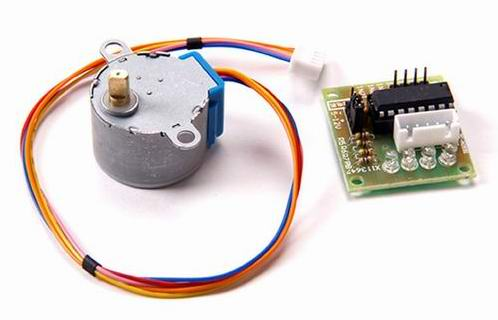

#step_moter: 实现驱动步进电机

##概述

驱动电机型号是28BYJ-48

淘宝有售: http://item.taobao.com/item.htm?id=6895887673

步进电机驱动的原理不复杂，网上有说明，下面大致转一下：

* 步进电机必须加驱动才可以运转， 驱动信号必须为脉冲信号，没有脉冲的时候，步进电机静止；
 如果加入适当的脉冲信号， 就会以一定的角度（称为步角）转动。转动的速度和脉冲的频率成正比。
* 28BYJ48 5V 驱动的4 相5 线的步进电机，而且是减速步进电机，减速比为1：64，步进角为5.625/64 度。如果需要转动1 圈，那么需要360/5.625*64=4096 个脉冲信号。
* 步进电机具有瞬间启动和急速停止的优越特性。
* 改变脉冲的顺序， 可以方便的改变转动的方向。
* 每一个脉冲信号对应步进电机的某一相或两相绕组的通电状态改变一次，也就对应转子转过一定的角度（一个步距角）。当通电状态的改变完成一个循环时，转子转过一个齿距。四相步进电机可以在不同的通电方式下运行，常见的通电方式有单（单相绕组通电）四拍（A-B-C-D-A。。。），双（双相绕组通电）四拍（AB-BC-CD-DA-AB-。。。），八拍（A-AB-B-BC-C-CD-D-DA-A。。。）。

更详细的内容，请拜读： http://www.ichanging.org/uln2003-to-drive-relay-and-motor.html

本例采用的是查表法输出驱动序列。使用了ULN2003作为驱动芯片。

##如何使用

代码首部宏定义设置了 4个IO引脚，可以将其依次连接驱动单元的D1~4四个引脚。电源（可以用5V）、地自行接好。

程序编译部署为"stepmotor"，运行后，在模块主页“委托接口测试”选项卡，可以输入下面的指令：

	{
		"method":"stepmotor.go",
		"params":{
			"speed": 500,
			"clockwise": true,
			"steps":4096
		}
	}

* speed: 速度
* clockwise: 是否顺时针
* steps: 运动步数

硬件连接正确的话，步进电机应该就可以转动了。

##备注
*本程序使用了noneblock框架，稍显复杂，以后改一个简单版本。*

##依赖
无

****
更多细节请参考源代码。

20131006
问题和建议请email: dy@wifi.io 

