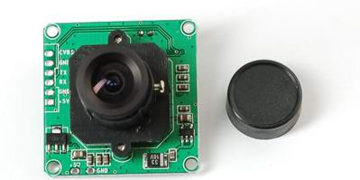
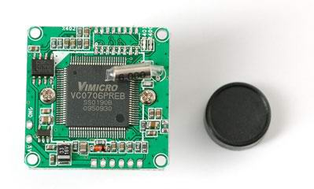
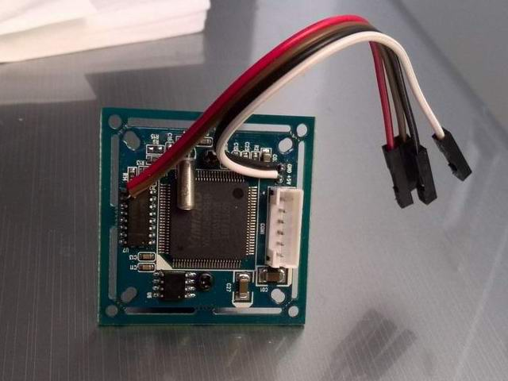

#使用串口摄像头来实现图像采集

##概述

市面上常见的串口摄像头多是采用了中星微的VC0706芯片设计的。

一般这种摄像头采用串口来连接用户系统。
wifiIO模块可以很简单的驱动起这类的摄像头。本示例演示了如何设计addon来给模块的网页服务器（httpd）提供新的功能——拍摄照片。

非常感谢 Adafruit 为Arduino写好了相关的驱动代码，使得本示例可以不用从轮子开始，很快就能驱动起这颗摄像头。本例参考代码来自于：
https://github.com/adafruit/Adafruit-VC0706-Serial-Camera-Library。

Arduino想要玩转拍摄图片，只能够将其存储到附带的SD卡中。

而wifiIO模组便有不同的玩法了，我们可以将其直接在本地浏览器上渲染出来，并且可以上传云端，甚至通过微信发送到您的手机上 ;-) 。
本例演示的是如何在本地访问，通过浏览器来观看拍摄到的图片。

##如何使用

本示例仅仅需要使用模块上串口2 就可以驱动VC0706芯片。注意，常见的摄像头模块提供的串口是RS232接口（板上有一颗max3232），而wifiIO模块上包含RS232和TTL接口两种引脚扇出，请注意区别连接。
（模块上SERIAL2 TTL引脚是 IO03 和 IO04， RS232的引脚是2TX和2RX）

摄像头模块  还需要5V电源，请注意正确连接。

本例使用了TTL电平接口，使用方便计，对摄像头模块做了焊接引线处理，如下图：

正确连接好后，编译代码，并以“sercam”名称部署运行（下面需要用到这个名称）。

在浏览器中打开模块的主页，改动地址栏为：http://192.168.1.xx/logic/sercam/snapshot，回车便可以打开一张图片，刷新页面便可以看到镜头输出变化的图像。这个url可以用标签嵌套在html文件中。

##备注

本例演示了如何通过插件为模块的web服务器（httpd）添加额外功能，SDK提供的API使开发者可以很简单的设计httpd后端的逻辑，细腻的实现浏览器与硬件交互的应用。

##依赖

httpd服务（参见代码中main函数的实现）

****
更多细节请参考源代码。

20131014

****
问题和建议可以email: dy@wifi.io 
