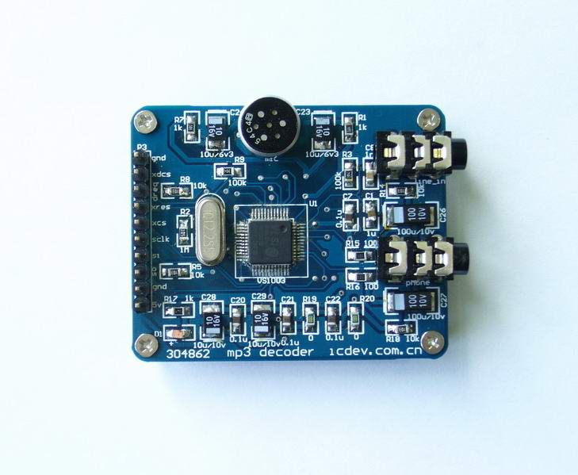

#vs1003: 实现mp3播放和录音

**文档大纲**

- [概述](#overview)
- [如何连接硬件](#how2connect)
- [如何使用本程序](#how2use)
- [备注](#notes)
- [依赖](#dependency)

##概述

vs1003就不用多说了吧。只说两点，第一这个可以解mp3；第二可以录制adpcm的音频；

本实践利用vs1003模块实现两个功能：播放本地TF卡上的mp3音乐，录制声音文件到TF卡上。

 
 

##如何连接硬件

总计需要连接9根线，包括2根电源线，需要连接5V和GND。

其他7根如下连接：

MOSI： IO15

MOSI： IO16

SCK： IO14
 
XDCS： IO03

XCS： IO04

DREQ： IO02

RST： IO13

##如何使用本程序

程序分为两个，"vs10xx_mp3.c" 和 "vs10xx_rec.c"，可以分别编译，前者实现mp3播放，后者录制音频。

###播放mp3

请建立 /app/vs1003目录（如果从云端部署为"vs1003"名称，会自动建立改目录），播放的mp3需要预先上传到 "/app/vs1003/demo.mp3"。

编译"vs10xx_mp3.c"，以"vs1003"名称加载运行本程序，便可以听到美妙的音乐啦。

###录制音频
请建立 /app/vs1003目录（如果从云端部署为"vs1003"名称，会自动建立改目录）

编译 "vs10xx_rec.c"，以"vs1003"名称加载运行本程序， 录制音频的程序便会录制5秒声音，并存放在 "/app/vs1003"目录，名称为"rec.wav"。

##备注
待播放的mp3程序 需要命名为“demo.mp3”，并预先上传 "/app/vs1003"目录；

录音程序会录制文件放置在 "/app/vs1003"目录，名称为“rec.wav”。

##依赖
无

****
更多细节请参考源代码。

20131109
问题和建议请email: dy@wifi.io 